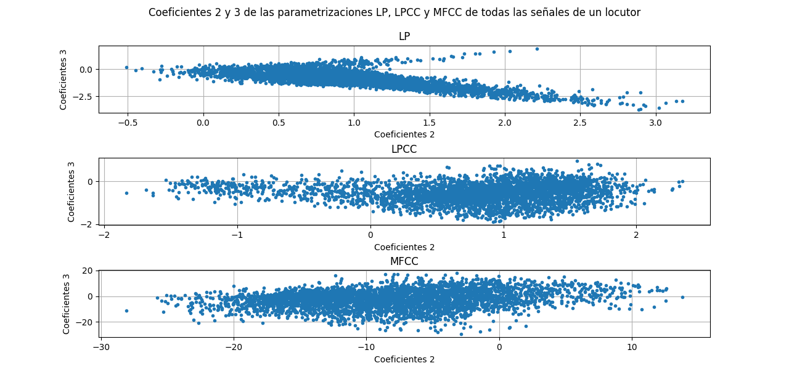

PAV - P4: reconocimiento y verificación del locutor
===================================================

Obtenga su copia del repositorio de la práctica accediendo a [Práctica 4](https://github.com/albino-pav/P4)
y pulsando sobre el botón `Fork` situado en la esquina superior derecha. A continuación, siga las
instrucciones de la [Práctica 2](https://github.com/albino-pav/P2) para crear una rama con el apellido de
los integrantes del grupo de prácticas, dar de alta al resto de integrantes como colaboradores del proyecto
y crear la copias locales del repositorio.

También debe descomprimir, en el directorio `PAV/P4`, el fichero [db_8mu.tgz](https://atenea.upc.edu/pluginfile.php/3145524/mod_assign/introattachment/0/spk_8mu.tgz?forcedownload=1)
con la base de datos oral que se utilizará en la parte experimental de la práctica.

Como entrega deberá realizar un *pull request* con el contenido de su copia del repositorio. Recuerde
que los ficheros entregados deberán estar en condiciones de ser ejecutados con sólo ejecutar:

~~~~~~~~~~~~~~~~~~~~~~~~~~~~~~~~~~~~~~~~~~~~~~~~~~~~~.sh
  make release
  run_spkid mfcc train test classerr verify verifyerr
~~~~~~~~~~~~~~~~~~~~~~~~~~~~~~~~~~~~~~~~~~~~~~~~~~~~~

Recuerde que, además de los trabajos indicados en esta parte básica, también deberá realizar un proyecto
de ampliación, del cual deberá subir una memoria explicativa a Atenea y los ficheros correspondientes al
repositorio de la práctica.

A modo de memoria de la parte básica, complete, en este mismo documento y usando el formato *markdown*, los
ejercicios indicados.

## Ejercicios.

### SPTK, Sox y los scripts de extracción de características.

- Analice el script `wav2lp.sh` y explique la misión de los distintos comandos involucrados en el *pipeline*
  principal (`sox`, `$X2X`, `$FRAME`, `$WINDOW` y `$LPC`). Explique el significado de cada una de las 
  opciones empleadas y de sus valores.
 
 ```bash
 # Main command for feature extration
  sox $inputfile -t raw -e signed -b 16 - | $X2X +sf | $FRAME -l 240 -p 80 | $WINDOW -l 240 -L 240 |
	$LPC -l 240 -m $lpc_order > $base.lp
  ```
 
  `sox`: llamamos a este programa (ya utilizado en la práctica 1) para convertir la señal .WAV a formato raw para que x2x pueda leer el fichero (ya que x2x sólo puede leer formato raw)
  `$X2X`: es el programa de SPTK que permite la conversión entre distintos formatos de datos. En nuestro caso utilizamos +sf para pasar de short a float y así tener reales en coma flotante de 32 bits. El resultado le pasamos a la salida estándar. 
  `$FRAME`: divide la señal de entrada en tramas de 240 muestras (30 ms) con desplazamiento de ventana de
  80 muestras (10 ms) teniendo en cuenta que utilizamos frecuencia de muestreo de 8 kHz. 
  `$WINDOW`: multiplica cada trama por la ventana de Blackman (opción por defecto).
  `$LPC`: calcula los lpc_order primeros coeficientes de predicción lineal, precedidos por el factor de
  ganancia del predictor.

  El resultado del pipeline se redirecciona a un fichero temporal, ubicado en el directorio /tmp, y
  cuyo nombre es el mismo que el del script seguido del identificador del proceso (de este modo se
  consigue un fichero temporal único para cada ejecución).

- Explique el procedimiento seguido para obtener un fichero de formato *fmatrix* a partir de los ficheros de
  salida de SPTK (líneas 45 a 47 del script `wav2lp.sh`).

```bash
# Our array files need a header with the number of cols and rows:
ncol=$((lpc_order+1)) # lpc p =>  (gain a1 a2 ... ap) 
nrow=`$X2X +fa < $base.lp | wc -l | perl -ne 'print $_/'$ncol', "\n";'`
```
El fichero fmatrix se compone en número de filas y de columnas seguidos por los datos. 

El numero de columnas (ncol) será igual al número de coeficientes, con lo cual será fácil de calcularlo ya que es el orden del predictor + 1 ya que en el primer elemento del vector se almacena la ganancia de predicción. 

El número de filas será igual al número de tramas. Como depende de la longitud de la señal, el desplazamiento y longitud de la ventana y de la cadena de comandos que se ejecutan para obtener la parametrización; por todo ello, es mejor, simplemente, extraer esa información del fichero obtenido. Lo hacemos convirtiendo la señal parametrizada a texto, usando +fa, y contando el número de líneas, con el comando de UNIX wc -l.

  * ¿Por qué es conveniente usar este formato (u otro parecido)? Tenga en cuenta cuál es el formato de
    entrada y cuál es el de resultado.
    
    Porque de esta forma veremos a la salida el valor de los coeficientes en cada trama, siendo cada columna el valor de cada coeficiente y cada fila el número de trama, así queda una visualización en forma de matriz que es una manera bastante ordenada comparada con el fichero temporal generado.

- Escriba el *pipeline* principal usado para calcular los coeficientes cepstrales de predicción lineal
  (LPCC) en su fichero <code>scripts/wav2lpcc.sh</code>:

```bash
# Main command for feature extration
sox $inputfile -t raw -e signed -b 16 - | $X2X +sf | $FRAME -l 240 -p 80 | $WINDOW -l 240 -L 240 |
	$LPC -l 240 -m $lpc_order | $LPCC -m $lpc_order -M $lpcc_order > $base.lpcc
```

- Escriba el *pipeline* principal usado para calcular los coeficientes cepstrales en escala Mel (MFCC) en su
  fichero <code>scripts/wav2mfcc.sh</code>:

```bash
# Main command for feature extration
sox $inputfile -t raw -e signed -b 16 - | $X2X +sf | $FRAME -l 240 -p 80 | $WINDOW -l 240 -L 240 |
	$MFCC -s 8 -l 240 -m  $mfcc_order -n $filterbank_order > $base.mfcc
```

### Extracción de características.

- Inserte una imagen mostrando la dependencia entre los coeficientes 2 y 3 de las tres parametrizaciones
  para todas las señales de un locutor.
  
  


  + Indique **todas** las órdenes necesarias para obtener las gráficas a partir de las señales 
    parametrizadas.
  
    Primero hemos utilizado la ayuda aportada en el pdf de la práctica para obtener en un fichero de texto los coeficientes 2 y 3 de todos los ficheros de un locutor cualquiera (hemos utilizado el SES017):
    
    ```bash
    fmatrix_show work/lp/BLOCK01/SES017/*.lp | egrep '^\[' | cut -f2,3 > lp_2_3.txt
    fmatrix_show work/lpcc/BLOCK01/SES017/*.lpcc | egrep '^\[' | cut -f2,3 > lpcc_2_3.txt
    fmatrix_show work/mfcc/BLOCK01/SES017/*.mfcc | egrep '^\[' | cut -f2,3 > mfcc_2_3.txt
    ```

    Como es lógico tenemos que crear 3 ficheros de texto, uno para cada parametrización.

    Después hemos optado por hacer la gráfica con Matplotlib. El código para mostrar la gráfica anterior es el siguiente:

    ```py
    import matplotlib.pyplot as plt
    import matplotlib.cbook as cbook
    import numpy as np


    lp = np.loadtxt('lp_2_3.txt')
    lpcc = np.loadtxt('lpcc_2_3.txt')
    mfcc = np.loadtxt('mfcc_2_3.txt')

    fig, ax = plt.subplots()
    ax.set(xlabel='Coeficientes 2', ylabel='Coeficientes 3')
    line1, = ax.plot(lp[:, 0], lp[:, 1])
    line2, = ax.plot(lpcc[:, 0], lpcc[:, 1])
    line3, = ax.plot(mfcc[:, 0], mfcc[:, 1])
    ax.legend((line1, line2, line3), ('lp', 'lpcc', 'mfcc'))
    ax.grid()
    plt.title("Coeficientes 2 y 3 de las parametrizaciones LP, LPCC y MFCC de todas las señales de un locutor")
    plt.show()
    ```

  + ¿Cuál de ellas le parece que contiene más información?

  Contener más información en este contexto, es sinónimo de que los coeficientes de mayor orden contengan valores que no sean 0. En base a esto, la parametrización MFCC es la que contiene más información ya que a simple vista vemos que: 

    - Coeficientes LP: los coeficientes de orden 3 de LP tienden ya prácticamente a 0 por lo que no nos proporcionan información.
    - Coeficientes LPCC: los coeficientes de LPCC observamos que aunque sus coeficientes de orden 3 no tienden a 0, vemos que tienen un margen dinámico de valores más reducido que los de MFCC tanto en los de orden 2 como 3. 
  
  Con lo cual los coeficientes de MFCC son los que mayor información conservan.  

- Usando el programa <code>pearson</code>, obtenga los coeficientes de correlación normalizada entre los
  parámetros 2 y 3 para un locutor, y rellene la tabla siguiente con los valores obtenidos.

  |                        | LP   | LPCC | MFCC |
  |------------------------|:----:|:----:|:----:|
  | &rho;<sub>x</sub>[2,3] |      |      |      |
  
  + Compare los resultados de <code>pearson</code> con los obtenidos gráficamente.
  
- Según la teoría, ¿qué parámetros considera adecuados para el cálculo de los coeficientes LPCC y MFCC?

### Entrenamiento y visualización de los GMM.

Complete el código necesario para entrenar modelos GMM.

- Inserte una gráfica que muestre la función de densidad de probabilidad modelada por el GMM de un locutor
  para sus dos primeros coeficientes de MFCC.
  
- Inserte una gráfica que permita comparar los modelos y poblaciones de dos locutores distintos (la gŕafica
  de la página 20 del enunciado puede servirle de referencia del resultado deseado). Analice la capacidad
  del modelado GMM para diferenciar las señales de uno y otro.

### Reconocimiento del locutor.

Complete el código necesario para realizar reconociminto del locutor y optimice sus parámetros.

- Inserte una tabla con la tasa de error obtenida en el reconocimiento de los locutores de la base de datos
  SPEECON usando su mejor sistema de reconocimiento para los parámetros LP, LPCC y MFCC.

### Verificación del locutor.

Complete el código necesario para realizar verificación del locutor y optimice sus parámetros.

- Inserte una tabla con el *score* obtenido con su mejor sistema de verificación del locutor en la tarea
  de verificación de SPEECON. La tabla debe incluir el umbral óptimo, el número de falsas alarmas y de
  pérdidas, y el score obtenido usando la parametrización que mejor resultado le hubiera dado en la tarea
  de reconocimiento.
 
### Test final

- Adjunte, en el repositorio de la práctica, los ficheros `class_test.log` y `verif_test.log` 
  correspondientes a la evaluación *ciega* final.

### Trabajo de ampliación.

- Recuerde enviar a Atenea un fichero en formato zip o tgz con la memoria (en formato PDF) con el trabajo 
  realizado como ampliación, así como los ficheros `class_ampl.log` y/o `verif_ampl.log`, obtenidos como 
  resultado del mismo.
